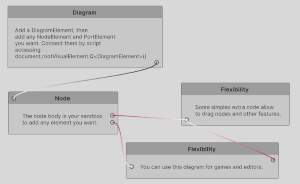
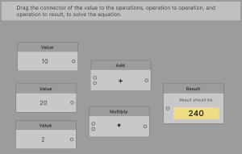
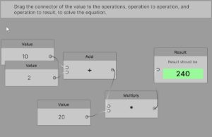
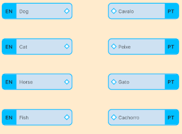
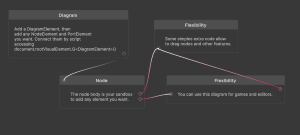
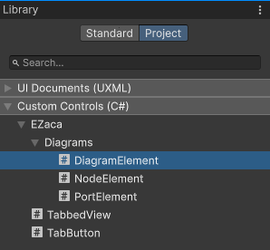

# Unity's UIToolkit Diagrams

Base components for building graphs/diagrams, similar to those found in visual scripting tools, using Unity's UIToolkit package.

**Motivation:** There are other solutions out there, but many are designed for legacy IMGUI editors, are editor-only, or too complex to get started with. Here, you'll find a simple and configurable diagram tool built with the new UIToolkit — just as easy as adding a new element in UI Builder — and ready for both editor and runtime use (since it's a UI element without editor dependencies). With this, I aim to address my personal criticisms of other solutions I've encountered.

## Showcase

## Get Started

To create a diagram, it's very simple:

1. Download and add the `EZaca` folder to your project under `Assets`.
2. Create a UI Document (UXML).
3. Add the stylesheets `DiagramBaseStyle.uss`, `DiagramLight.uss`, and `DiagramDark.uss` from `Assets\EZaca\Diagrams\Core\Styles`.
4. *(Optional)* Add a ScrollView to your document, set it to Flex grow, and place the diagram inside it.
5. Add a `DiagramElement` to your document (you may want to set its width and height if you're using a ScrollView).
6. Add the `NodeElement` items you want (you can toggle the `Movable` option).
7. Add `PortElement` items to the body of your nodes if you want to connect them.
8. Add a UIDocument to your scene (GameObject and component).
9. Reference your UXML file there.

To connect nodes and allow the user to connect them:

1. Add a new MonoBehaviour to your UIDocument GameObject.  
2. In `OnEnable`, get a reference to the UIDocument.
3. Get a reference to your `DiagramElement`.  
   E.g.: `var diagram = UIDocument.rootVisualElement.Q<DiagramElement>()`  
4. Get references to the `PortElement` instances in the nodes.  
5. Use `diagram.Connect(port1, port2, painter)` to connect them.  
6. Create a painter using `new BasicConnectionPaint()`.  
7. Allow the user to drag connections using: `diagram.AddDragConnectionService()`.  
8. Add further setup to the items, such as the `DragConnectionManipulator` returned from `AddDragConnectionService`, or customize the `BasicConnectionPaint`.

What is planned and may change?

## What is planned and may change

- `DiagramDark.uss` and `DiagramLight.uss` are currently separate files for easier maintenance. Merging all three USS files is under consideration.
- While you can use the current setup via C# scripts, an `EnhancedDiagram` component is being considered, which would expose common configurations as properties.
- A different connection of a straight line with smooth start and end is also being considered for `BasicConnectionPaint`.
